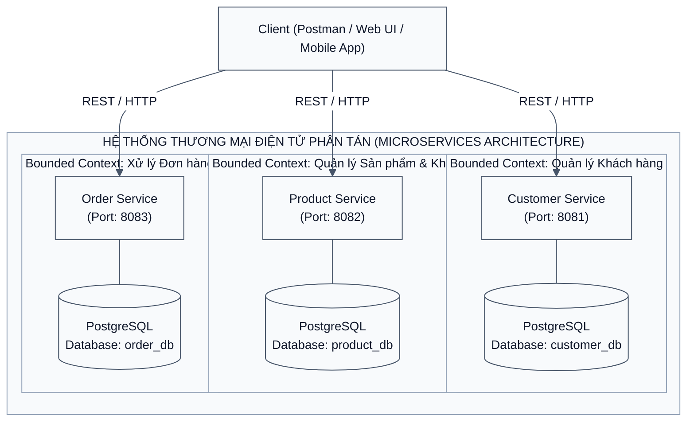
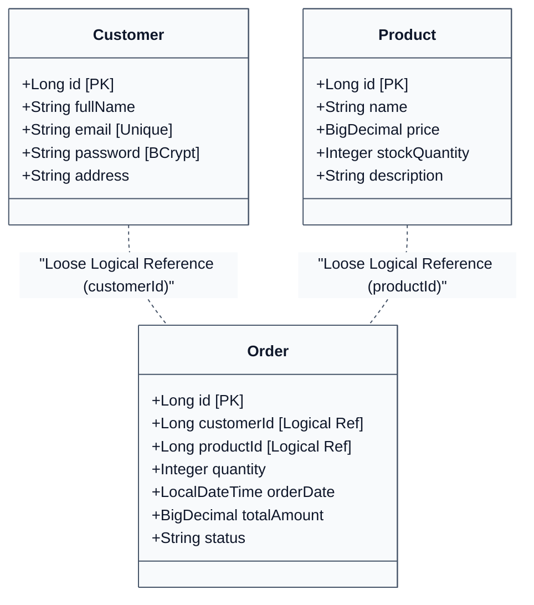
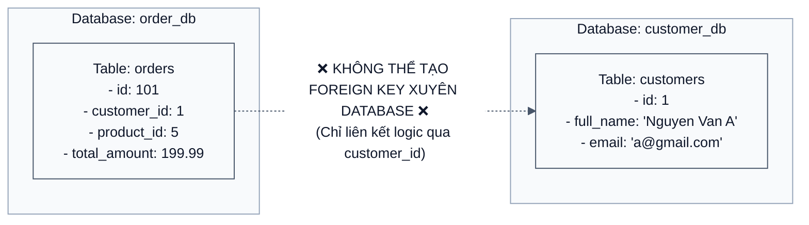
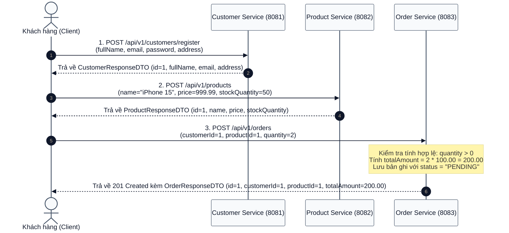

# [BÀI TẬP 1] THIẾT KẾ KIẾN TRÚC PHÂN RÃ (DECOMPOSITION) & XÁC ĐỊNH RANH GIỚI BOUNDED CONTEXT

## BẢN THIẾT KẾ PHÂN TÁCH HỆ THỐNG THƯƠNG MẠI ĐIỆN TỬ THÀNH 3 MICROSERVICES ĐỘC LẬP THEO PHƯƠNG PHÁP DOMAIN-DRIVEN DESIGN (DDD)

> **Đề bài:** Phân tách hệ thống TMĐT thành 3 Project Spring Boot độc lập. Xác định các thực thể và thuộc tính:
> - **Customer Service:** Thực thể `Customer` (`id`, `fullName`, `email`, `password`, `address`).
> - **Product Service:** Thực thể `Product` (`id`, `name`, `price`, `stockQuantity`, `description`).
> - **Order Service:** Thực thể `Order` (`id`, `customerId`, `productId`, `quantity`, `orderDate`, `totalAmount`, `status`).
> 
> *Lưu ý:* Các module không được dùng chung database, không được gọi trực tiếp vào Code của nhau.
> 
> **Kết quả mong muốn:** Bản thiết kế chi tiết (kèm sơ đồ) về các thực thể và lý do cốt lõi tại sao `Order` chỉ nên lưu `customerId` mà không lưu cả đối tượng `Customer`.

---

## MỤC LỤC

1. [Tổng quan Kiến trúc Phân rã Hệ thống (System Decomposition)](#1-tổng-quan-kiến-trúc-phân-rã-hệ-thống-system-decomposition)
   - 1.1. Từ Khối Đơn khối (Monolith) đến Kiến trúc Hướng miền (DDD Decomposition)
   - 1.2. Phân định Bounded Context và ranh giới trách nhiệm (Service Boundaries)
2. [Thiết kế Mô hình Thực thể & Schema Cơ sở Dữ liệu Độc lập](#2-thiết-kế-mô-hình-thực-thể--schema-cơ-sở-dữ-liệu-độc-lập)
   - 2.1. Customer Service Context (`customer_db`)
   - 2.2. Product Service Context (`product_db`)
   - 2.3. Order Service Context (`order_db`)
   - 2.4. Sơ đồ Quan hệ Thực thể Phân tán (Distributed Entity Boundaries)
3. [Phân tích Chuyên sâu: Tại sao `Order` chỉ lưu `customerId` thay vì toàn bộ đối tượng `Customer`?](#3-phân-tích-chuyên-sâu-tại-sao-order-chỉ-lưu-customerid-thay-vì-toàn-bộ-đối-tượng-customer)
   - 3.1. Tính Tách rời Lỏng lẻo (Loose Coupling) & Độc lập Triển khai
   - 3.2. Triệt tiêu Ràng buộc Vật lý (Physical Foreign Key Constraints)
   - 3.3. Vấn đề Đồng bộ Dữ liệu Lỗi thời (Stale Data Anomaly)
   - 3.4. Bảo mật Dữ liệu & Tuân thủ Nguyên tắc Đặc quyền Tối thiểu (Principle of Least Privilege)
   - 3.5. Hiệu năng Truy vấn, Tải trọng Mạng (Network Payload) & Bounded Context Purity
4. [Mô hình Giao tiếp Liên Dịch vụ (Inter-Service Interaction Flow)](#4-mô-hình-giao-tiếp-liên-dịch-vụ-inter-service-interaction-flow)
   - 4.1. Luồng tạo đơn hàng và kiểm tra nghiệp vụ
   - 4.2. Khả năng tích hợp Service Registry (Eureka) & API Gateway trong tương lai
5. [Kết luận của em](#5-kết-luận-của-em)

---

## 1. Tổng quan Kiến trúc Phân rã Hệ thống (System Decomposition)

### 1.1. Từ Khối Đơn khối (Monolith) đến Kiến trúc Hướng miền (DDD Decomposition)

Trong mô hình Monolith truyền thống, toàn bộ nghiệp vụ Quản lý Khách hàng, Sản phẩm tồn kho và Đặt hàng thường nằm chung trong một cơ sở dữ liệu quan hệ duy nhất và cùng một gói mã nguồn. Mặc dù cách tiếp cận này đơn giản trong giai đoạn đầu, nó nhanh chóng bộc lộ các hạn chế chết người:
- **Khóa chặt cơ sở dữ liệu (Database Tight Coupling):** Việc sử dụng các khóa ngoại (`FOREIGN KEY`) và câu lệnh `JOIN` phức tạp xuyên suốt các bảng khiến schema bị đông cứng; bất kỳ sự thay đổi cấu trúc nào tại bảng Khách hàng cũng có thể làm đổ vỡ logic Đơn hàng.
- **Điểm nghẽn triển khai (Deployment Bottleneck):** Một sửa đổi nhỏ trong thuật toán mã hóa mật khẩu khách hàng buộc phải đóng gói và tái triển khai lại toàn bộ hệ thống bán lẻ.
- **Điểm chịu lỗi đơn (Single Point of Failure - SPOF):** Khi lượng truy cập mua sắm tăng đột biến làm quá tải module Đơn hàng, toàn bộ hệ thống bị sập khiến người dùng không thể xem hồ sơ hoặc tra cứu danh mục sản phẩm.

Áp dụng phương pháp luận **Domain-Driven Design (DDD)** và bài học phân tách module, hệ thống Thương mại Điện tử được phân rã thành **3 Bounded Contexts** độc lập tương ứng với **3 Spring Boot Microservices** riêng biệt:



### 1.2. Phân định Bounded Context và ranh giới trách nhiệm (Service Boundaries)

| Tiêu chí | Customer Service | Product Service | Order Service |
| :--- | :--- | :--- | :--- |
| **Port dịch vụ** | `8081` | `8082` | `8083` |
| **Cơ sở dữ liệu** | `customer_db` (PostgreSQL) | `product_db` (PostgreSQL) | `order_db` (PostgreSQL) |
| **Trách nhiệm cốt lõi** | Quản lý thông tin định danh, đăng ký, đăng nhập, bảo mật mật khẩu khách hàng. | Quản lý danh mục hàng hóa, bảng giá, số lượng hàng trong kho, mô tả sản phẩm. | Tiếp nhận yêu cầu mua sắm, khởi tạo trạng thái đơn hàng, tính toán tổng tiền. |
| **Quyền sở hữu dữ liệu** | Độc quyền sở hữu bảng `customers`. Không cho phép service khác can thiệp trực tiếp. | Độc quyền sở hữu bảng `products`. Đảm bảo tính nhất quán của hàng tồn kho. | Độc quyền sở hữu bảng `orders`. Chỉ tham chiếu ID đối tác bên ngoài. |
| **Ranh giới giao tiếp** | Cung cấp RESTful API: Đăng ký, Đăng nhập, Lấy thông tin cá nhân theo ID. | Cung cấp RESTful API: Thêm sản phẩm (Validate giá/kho), Tra cứu chi tiết, Liệt kê. | Cung cấp RESTful API: Đặt hàng (`customerId`, `productId`, `quantity`), Tra cứu đơn hàng. |

---

## 2. Thiết kế Mô hình Thực thể & Schema Cơ sở Dữ liệu Độc lập

Mỗi dịch vụ tuân thủ triệt để nguyên lý **Database per Service**. Dữ liệu được lưu trữ trên các database vật lý riêng biệt, bảo đảm rằng nếu một database gặp sự cố hoặc cần bảo trì nâng cấp schema, các dịch vụ còn lại hoàn toàn không bị ảnh hưởng.

### 2.1. Customer Service Context (`customer_db`)

- **Thực thể:** `Customer`
- **Mục đích:** Lưu trữ hồ sơ định danh người dùng hệ thống. Mật khẩu được mã hóa an toàn bằng thuật toán BCrypt trước khi ghi xuống đĩa.

```sql
-- DDL Schema trên database: customer_db
CREATE TABLE IF NOT EXISTS customers (
    id BIGSERIAL PRIMARY KEY,
    full_name VARCHAR(100) NOT NULL,
    email VARCHAR(100) NOT NULL UNIQUE,
    password VARCHAR(255) NOT NULL,
    address VARCHAR(255)
);
```

### 2.2. Product Service Context (`product_db`)

- **Thực thể:** `Product`
- **Mục đích:** Lưu trữ thông tin mặt hàng, giá niêm yết bán lẻ và số lượng tồn kho khả dụng. Áp dụng các ràng buộc kiểm tra hợp lệ nghiêm ngặt (giá > 0, tồn kho >= 0).

```sql
-- DDL Schema trên database: product_db
CREATE TABLE IF NOT EXISTS products (
    id BIGSERIAL PRIMARY KEY,
    name VARCHAR(255) NOT NULL,
    price NUMERIC(12, 2) NOT NULL CHECK (price > 0),
    stock_quantity INT NOT NULL CHECK (stock_quantity >= 0),
    description TEXT
);
```

### 2.3. Order Service Context (`order_db`)

- **Thực thể:** `Order`
- **Mục đích:** Ghi nhận phiên giao dịch đặt hàng của khách hàng đối với sản phẩm. 
- **Đặc điểm kiến trúc then chốt:** Lưu `customer_id` và `product_id` dưới dạng trường số nguyên thuần túy (`BIGINT`). Tuyệt đối **không** tạo `FOREIGN KEY` liên kết sang `customer_db` hay `product_db`.

```sql
-- DDL Schema trên database: order_db
CREATE TABLE IF NOT EXISTS orders (
    id BIGSERIAL PRIMARY KEY,
    customer_id BIGINT NOT NULL,
    product_id BIGINT NOT NULL,
    quantity INT NOT NULL CHECK (quantity > 0),
    order_date TIMESTAMP WITHOUT TIME ZONE DEFAULT CURRENT_TIMESTAMP,
    total_amount NUMERIC(14, 2) NOT NULL,
    status VARCHAR(50) DEFAULT 'PENDING'
);
```

### 2.4. Sơ đồ Quan hệ Thực thể Phân tán (Distributed Entity Boundaries)



---

## 3. Phân tích Chuyên sâu: Tại sao `Order` chỉ lưu `customerId` thay vì toàn bộ đối tượng `Customer`?

Đây là một câu hỏi phỏng vấn kiến trúc Microservices kinh điển. Trong tư duy Monolith truyền thống với Hibernate/JPA, lập trình viên thường viết:
```java
// PHẢN MẪU TRONG MICROSERVICES (TIGHT COUPLING):
@ManyToOne(fetch = FetchType.LAZY)
@JoinColumn(name = "customer_id")
private Customer customer;
```
Tuy nhiên, trong kiến trúc Microservices hiện đại, `Order` **chỉ được phép lưu định danh số nguyên `Long customerId`**. Dưới đây là 5 lý do cốt lõi mang tính quyết định:

### 3.1. Tính Tách rời Lỏng lẻo (Loose Coupling) & Độc lập Triển khai

Nếu thực thể `Order` nhúng toàn bộ đối tượng `Customer`, mã nguồn của dự án `order-service` bắt buộc phải import định nghĩa lớp `Customer` (hoặc phụ thuộc vào thư viện dùng chung chứa `Customer`).
- Bất cứ khi nào team phát triển `Customer Service` bổ sung thêm trường (ví dụ: `phoneNumber`, `dateOfBirth`, `avatarUrl`, `loyaltyTier`), team `Order Service` cũng bị kéo theo: phải recompile, chạy lại test suite, và triển khai lại mã nguồn.
- Việc chỉ lưu trường `customerId: Long` tạo ra một giao ước cực kỳ ổn định. Định danh khách hàng là bất biến trong suốt vòng đời của một tài khoản, giúp `Order Service` hoàn toàn miễn nhiễm với các thay đổi nội bộ của `Customer Service`.

### 3.2. Triệt tiêu Ràng buộc Vật lý (Physical Foreign Key Constraints)

Trong kiến trúc **Database per Service**, `order_db` và `customer_db` là hai cơ sở dữ liệu vật lý nằm tách biệt trên các server hoặc instance khác nhau:
- Các hệ quản trị cơ sở dữ liệu quan hệ (như PostgreSQL, MySQL) **không hỗ trợ** tạo Foreign Key xuyên qua các database độc lập nằm trên các host khác nhau trong một giao dịch ACID chuẩn.
- Do đó, việc cấu hình `@ManyToOne` hay `@JoinColumn` của JPA sẽ lập tức ném ngoại lệ khi ứng dụng khởi động hoặc cố gắng sinh DDL. Việc dùng `Long customerId` phản ánh đúng bản chất phân tán của kiến trúc hệ thống.



### 3.3. Vấn đề Đồng bộ Dữ liệu Lỗi thời (Stale Data Anomaly)

Giả sử `order-service` lưu toàn bộ thông tin đối tượng `Customer` (`fullName`, `email`, `password`, `address`) ngay trong bản ghi đơn hàng:
- Khi khách hàng đổi mật khẩu hoặc cập nhật địa chỉ giao dịch mới, dữ liệu khách hàng được nhúng trong các đơn hàng cũ sẽ trở nên **lỗi thời (Stale Data)** hoặc không nhất quán.
- Ngược lại, nếu muốn đồng bộ lại, hệ thống phải thực hiện Distributed Transactions (2PC - Two Phase Commit) vô cùng phức tạp và làm suy giảm nghiêm trọng thông lượng xử lý của toàn hệ thống.
- Bằng cách chỉ lưu `customerId`, khi cần hiển thị thông tin khách hàng trên hóa đơn hiện tại, `Order Service` hoặc tầng API Gateway chỉ cần gọi REST API sang `Customer Service` lấy dữ liệu tươi mới nhất tại thời điểm truy vấn.

### 3.4. Bảo mật Dữ liệu & Tuân thủ Nguyên tắc Đặc quyền Tối thiểu (Principle of Least Privilege)

Thực thể `Customer` chứa những thông tin vô cùng nhạy cảm: **mật khẩu băm (BCrypt hash)**, thông tin nhận dạng cá nhân (PII), thông tin thẻ tín dụng/thanh toán.
- Nhân viên vận hành xử lý đơn hàng (Order Fulfillment Staff) chỉ cần biết mã khách hàng, số lượng và tổng tiền. Họ **không có quyền** và **không được phép** nhìn thấy mật khẩu hay thông tin bảo mật của khách hàng.
- Nếu `Order Service` lưu trữ cả đối tượng `Customer`, nguy cơ rò rỉ dữ liệu mật khẩu qua log, bản sao lưu database đơn hàng (DB dump), hoặc các API trả về của đơn hàng là cực kỳ cao. Lưu `customerId` giúp cô lập phạm vi bảo mật.

### 3.5. Hiệu năng Truy vấn, Tải trọng Mạng (Network Payload) & Bounded Context Purity

| Tiêu chí | Lưu toàn bộ `Customer` trong `Order` | Chỉ lưu `customerId: Long` (Chuẩn mực Microservices) |
| :--- | :--- | :--- |
| **Kích thước bản ghi (Row Size)** | Rất lớn (chứa hàng chục thuộc tính của người dùng). Làm phình to dung lượng ổ đĩa của `order_db`. | Tối ưu hóa tối đa (chỉ chiếm đúng 8 bytes của kiểu dữ liệu `BIGINT`). |
| **Tốc độ ghi DB (Write IOPS)** | Chậm hơn do phải tuần tự hóa và lưu trữ payload lớn. | Nhanh vượt trội, phục vụ hàng chục ngàn thao tác chốt đơn mỗi giây. |
| **Băng thông mạng REST API** | Lãng phí băng thông khi trả về danh sách 1.000 đơn hàng kèm toàn bộ thông tin chi tiết của khách. | Gọn nhẹ, chỉ trả về các trường dữ liệu cần thiết phục vụ ngữ cảnh đơn hàng. |
| **Độ thuần khiết Domain (DDD)** | Vi phạm Bounded Context: Ngữ cảnh Đơn hàng bị ô nhiễm bởi khái niệm của Quản lý Khách hàng. | Hoàn hảo: Ngữ cảnh nào sở hữu đúng dữ liệu thuộc trách nhiệm của ngữ cảnh đó. |

---

## 4. Mô hình Giao tiếp Liên Dịch vụ (Inter-Service Interaction Flow)

### 4.1. Luồng tạo đơn hàng và kiểm tra nghiệp vụ

Khi một khách hàng tiến hành đặt hàng thông qua Client:



### 4.2. Khả năng tích hợp Service Registry (Eureka) & API Gateway trong tương lai

Trong các giai đoạn phát triển tiếp theo (Session 04 & 05):
1. **Service Registry (Netflix Eureka Server):** Cả 3 dịch vụ sẽ tự động đăng ký tên định danh (`CUSTOMER-SERVICE`, `PRODUCT-SERVICE`, `ORDER-SERVICE`) và địa chỉ IP/Port lên Eureka Server.
2. **Dynamic Service Discovery:** Khi `Order Service` cần kiểm tra xem `productId=1` có tồn tại hay không và lấy đơn giá thực tế từ `Product Service`, nó sẽ tra cứu địa chỉ từ Eureka Server thông qua `DiscoveryClient` hoặc `FeignClient` có tích hợp `@LoadBalanced` thay vì cấu hình cứng địa chỉ `http://localhost:8082`.
3. **API Gateway (Spring Cloud Gateway):** Là điểm tiếp nhận duy nhất cho toàn bộ hệ thống từ Client, thực hiện routing thông minh, xác thực bảo mật JWT tập trung và cân bằng tải.

---

## 5. Kết luận của em

Qua bài tập thiết kế kiến trúc phân rã (Decomposition) này, em đã rút ra những bài học then chốt:

1. **Hiểu sâu sắc tư duy Domain-Driven Design (DDD):** Không thể áp dụng tư duy cơ sở dữ liệu nguyên khối vào kiến trúc Microservices. Việc xác định ranh giới Bounded Context rõ ràng giữa `Customer`, `Product` và `Order` là nền tảng để hệ thống có khả năng mở rộng không giới hạn (horizontal scalability).
2. **Tuân thủ nguyên tắc Database per Service:** Mỗi microservice phải hoàn toàn làm chủ cơ sở dữ liệu của mình (`customer_db`, `product_db`, `order_db`), loại bỏ hoàn toàn các liên kết Foreign Key vật lý giữa các database.
3. **Ý nghĩa cốt lõi của việc `Order` chỉ lưu `customerId`:** Đây không phải là sự thiếu sót dữ liệu, mà là một quyết định kiến trúc chuẩn mực nhằm đảm bảo tính tách rời lỏng lẻo (Loose Coupling), loại bỏ rủi ro rò rỉ dữ liệu mật khẩu/thông tin cá nhân, triệt tiêu bài toán đồng bộ dữ liệu lỗi thời (Stale Data), và tối ưu hóa vượt bậc hiệu năng lưu trữ cũng như băng thông mạng.
